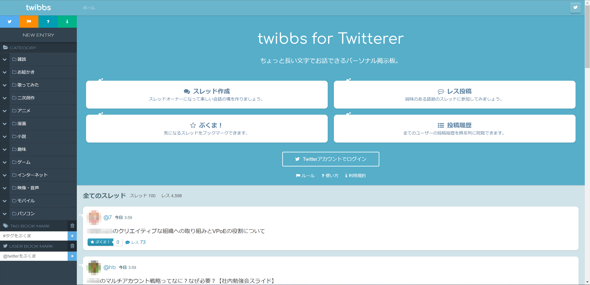
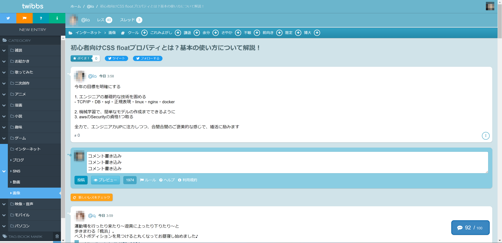
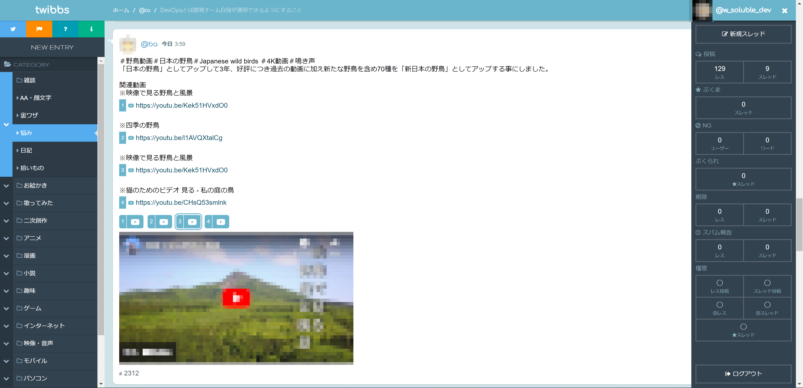

# 1. 目次

- [1. 目次](#1-目次)
- [2. 作成したソフトウェアについて](#2-作成したソフトウェアについて)
- [3. 外観](#3-外観)
  - [3.1. トップ画面](#31-トップ画面)
  - [3.2. スレッド画面](#32-スレッド画面)
- [4. 作成した目的](#4-作成した目的)
- [5. 使用言語およびツール](#5-使用言語およびツール)
- [6. プロジェクト](#6-プロジェクト)
  - [6.1. Spider版](#61-spider版)
  - [6.2. ノーマル版](#62-ノーマル版)

# 2. 作成したソフトウェアについて

Twitterユーザー向けの簡易掲示板です。
Twitterユーザーがログインして、自分のスレッドを作成したり、他人の作成したスレッドにコメントを書き込んだりすることができます。（Twitter連携ログインしない場合は閲覧のみ可能。）

# 3. 外観

## 3.1. トップ画面

## 3.2. スレッド画面

# 4. 作成した目的

Dockerによる環境構築、バックエンド、フロントエンド開発の学習目的で作成しました。

# 5. 使用言語およびツール

| # | 使用言語・ツール |
| :--- | :--- |
| 実装期間 | 2016～2017年 |
| バックエンド言語 | PHP（[Codeigniter3.1](https://codeigniter.jp/user_guide/3/)） |
| フロントエンド言語 | jQuery、CSS、HTML |
| データベース | MariaDB（ストアドプロシージャ、トリガー使用） |
| Webサーバー | Apache |
| コンテナ | Docker（Docker Compose使用） |
| 他 | cron、phpMyAdmin（MySQL管理画面） |

# 6. プロジェクト

## 6.1. Spider版

ネットワークをまたいでテーブルをシャーディング（水平分散）する機能を備えた[Spiderストレージエンジン](https://mariadb.com/kb/en/spider-storage-engine-overview/)を使用。ただし、このプロジェクトは一つのDBサーバー（db_masterコンテナ）内でシャーディングしております。

https://github.com/wsoluble/twibbs/tree/master/dev/spider

## 6.2. ノーマル版

InnoDBを使用。

https://github.com/wsoluble/twibbs/tree/master/dev/normal

