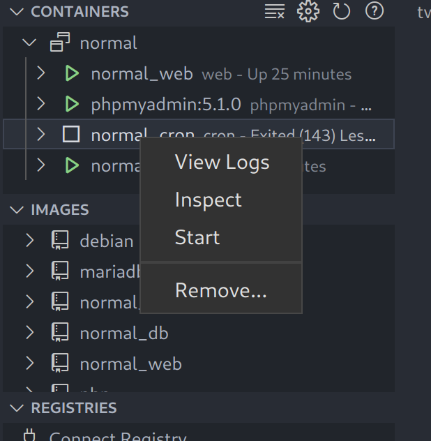
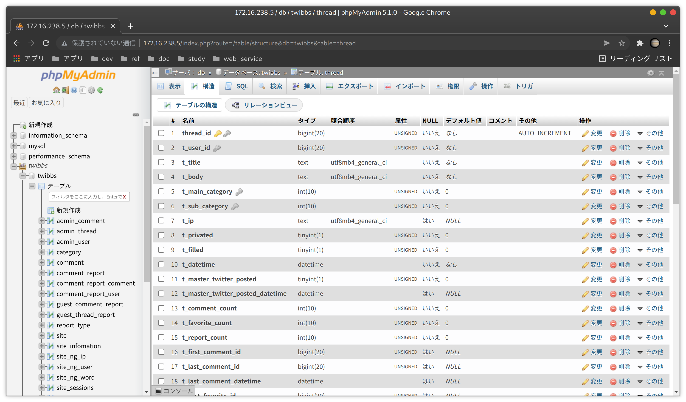
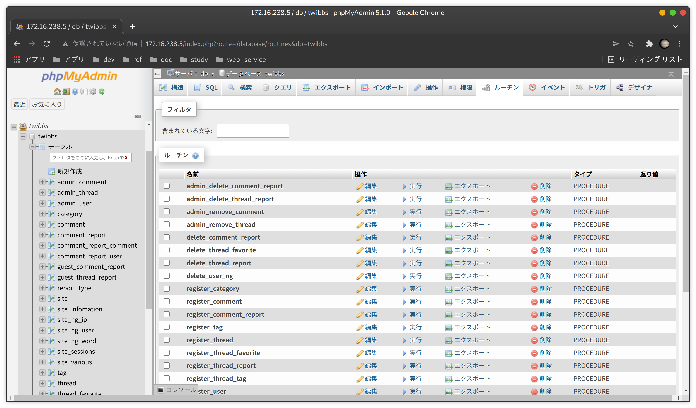
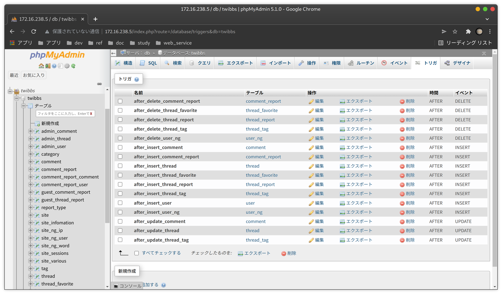

# 1. このプロジェクトについて

このプロジェクトは、twibbsをInnoDBストレージエンジンで実装したバージョンです。Dockerコンテナとして動作するWebアプリケーションとして実装しています。
ビルドに関する情報はdocker-compose.ymlに記述します。

この文書で記述するコマンドは、Ubuntu上で実行されるものとします。

## 1.1. TwitterAPIキー及びトークンの設定

TwitterAPIのキー及びトークンをsite.phpに設定します。（この設定をしないとログインができません。）
https://github.com/wsoluble/twibbs/blob/master/dev/normal/project/volumes/web/app/site_example.php を「site.php」の名前でコピーして、site.phpの以下の定数に値を設定します。

|  定数   | 説明  |
| ---- | ---- |
|  CONSUMER_KEY  |  Twitter Appの「API Key」を設定。  |
|  CONSUMER_SECRET  |  Twitter Appの「API Key Secret」を設定。  |
|  WEBMASTER_ACCESS_TOKEN  |  Twitter Appの「Access Token」を設定。  |
|  WEBMASTER_ACCESS_TOKEN_SECRET  |  Twitter Appの「Access Token Secret」を設定。  |

定数に設定するキー及びトークンは、TwitterのDeveloperPortalでAppを作成し、「Keys and tokens」タブを開き「API Key and Secret」と「Access Token and Secret」を開いて確認します。
https://developer.twitter.com/en/portal/dashboard

「User authentication settings」に設定するコールバックURLは、「`http://127.0.0.1/login/callback`」です。

## 1.2. Dockerビルド＆コンテナの起動

build.shを実行します。

```bash
cd [normal版ディレクトリ]
sudo ./setting.sh
./build.sh
```

Dockerビルド＆コンテナの起動後に、マシンを再起動した場合は、cronのコンテナを手動で起動する必要があります。起動するには、以下のコマンドを実行するか、vscodeのDocker拡張機能から「Start」を選択して起動します。

```bash
docker start cron
```




## 1.3. Dockerコンテナの削除

remove.shを実行します。

```bash
cd [normal版ディレクトリ]
./remove.sh
```

### 1.3.1 ログファイルについて

コンテナを削除した後に、プロジェクトのlogsフォルダの各フォルダ内にログファイルが残りますので、任意で削除してください。

|  フォルダ名  |  説明  |
| ---- | ---- |
|  cron  |  cron（定期処理）実行ログ。  |
|  db  |  データベース関連のログファイル  |
|  initdb  |  Dockerをビルドした際に実行されるデータベース初期化処理のログファイル。  |
|  web  |  ウェブアプリケーションのアクセスログ、エラーログなど。  |

### 1.3.2 volumesフォルダのRSS及びsitemap.xmlについて

コンテナを削除した後に、プロジェクトのvolumesフォルダのRSSフォルダにcronによって出力フィードファイルが残ります。また、volumesフォルダのsitemap.xmlファイルにcronによって出力されたサイトマップの内容が残ります。

|  フォルダ or ファイル名  |  説明  |
| ---- | ---- |
|  rssフォルダ  |  フォルダに含まれるxmlファイルは任意で削除してください。  |
|  sitemap.xmlファイル  |  任意で内容を空にしてください。削除はしないでください。間違えて削除した場合は、空のサイトマップファイルを作成してください。  |

# 2. データベース

データベースはMariaDBを使用します。

## 2.1 データベースの管理

データベースは、PHPMyAdminで管理します。
Dockerコンテナを起動した後に、以下のURLにアクセスすることで、PHPMyAdminを利用できます。

PHPMyAdmin: http://127.0.0.1:8081

```bash
# PHPMyAdminログイン情報
ユーザー: root
パスワード: meteor
```

ただし、コンテナをビルドする際にデータベースのインポート処理が実行されるため、処理が終わるまでのしばらくの間、ログインが拒否されますのでお待ちください（connection refusedエラー）。

rootパスワードについては、docker-compose.ymlが参照する.envファイルのMYSQL_ROOT_PASSWORD環境変数に記述しています。

## 4.2 データベースの実装方法

SELECTなどの参照系クエリについては、phpファイル内でSQL文を組み立てる形で実装します。<br><br>
INSERT・UPDATE・DELETEなどの更新系クエリについては、ストアドプロシージャとして実装します。phpからストアドプロシージャを実行する際には、CALL句で指定のストアドプロシージャ名および引数を指定します。<br><br>
更新系クエリによってテーブルが更新されたときに、他のテーブルの依存カラムの値を更新する必要がある場合、トリガーを使用します。

## 4.3 テーブルの確認方法

phpMyAdminにログインした後、画面左側にテーブルの一覧が表示されます。
確認したいテーブル名を選択すると、画面右側にテーブルの情報が表示されます。



## 4.4 ストアドプロシージャの確認方法

phpMyAdminにログインした後、画面左側のメニューから`twibbs`データベースを選択して、画面右上の`ルーチン`タブを選択します。すると、ストアドプロシージャの一覧が表示されますので、確認したいストアドプロシージャの`編集`を選択すると、内容が確認できます。



## 4.5 トリガーの確認方法

phpMyAdminにログインした後、画面左側のメニューから`twibbs`データベースを選択して、画面右上の`トリガー`タブを選択します。すると、トリガーの一覧が表示されますので、確認したいトリガーの`編集`を選択すると、内容が確認できます。




# 3. 実装したファイル一覧

Codeigniterフレームワークには多くのライブラリやシステムファイルが含まれているので、手を加えたファイルや、新たに追加したファイルを管理する必要があります。

この章では手を加えたファイルと、新たに追加したファイルの一覧をテーブルで記述します。

## 3.1 webコンテナのファイル

webコンテナとは、docker-compose.ymlのservicesに記述されている`web`という名前のサービスのコンテナのことです。

### 3.1.1 公開領域に配置するファイル

以下のディレクトリは、webコンテナの公開領域`/var/www/public`に配置します。

https://github.com/wsoluble/twibbs/tree/master/dev/normal/project/web/public

#### フォルダ / ファイル一覧

|  フォルダ [public/]   |  ファイル  |  説明  |
| ---- | ---- | ---- |
|    |  .htaccess  |  アクセス制御やURLルーティングなどを設定するファイル。  |
|    |  index.php  |  Codeigniterフレームワークの処理の入り口。  |
|    |  sitemap.xml<span style="color: red; ">[*]</span>  |  サイトマップ。  |
|  css  |    |  cssファイルを入れるフォルダ。  |
|  fonts  |    |  アイコンフォントなどのフォントファイルを入れるフォルダ。  |
|  html  |    |  エラーやリダイレクトで使用するhtmlファイルを入れるフォルダ。  |
|  img  |    |  ロゴやファビコンを入れるフォルダ。  |
|  js  |    |  jsファイルを入れるフォルダ。  |
|  svg  |    |  svgファイルを入れるフォルダ。  |
|  rss<span style="color: red; ">[*]</span>  |    |  RSSファイルを入れるフォルダ。  |

<span style="color: red; ">[*]</span> コンテナ間で共有されるファイルまたはフォルダ。volumesフォルダに実態ファイルを格納します。

### 3.1.2 アプリケーションファイル

以下のディレクトリは、Codeigniterフレームワーク関連ファイルです。webコンテナ内の`/var/www/app`ディレクトリに配置します。

https://github.com/wsoluble/twibbs/tree/master/dev/normal/project/web/app

以下のテーブルは、Codeigniterフレームワークの中で、自らが手を加えたファイル、または自らが追加したファイルの一覧です。

#### フォルダ / ファイル一覧

|  フォルダ [app/]  |  ファイル  |  説明  |
| ---- | ---- | ---- |
|    |  site.php<span style="color: red; ">[*]</span>  |  サイト設定の定数を定義するファイル。  |
|  application  |    |  Codeigniterのアプリケーションフォルダ。  |
|  application/config  |    |  Codeigniterの設定ファイルが入っているフォルダ。  |
|    |  config.php  |  Codeigniterの設定ファイル。セッションやクッキーの設定を行う。  |
|    |  database.php  |  データベースの設定ファイル。  |
|    |  routes.php  |  URLと実行するphpファイルのルーティングを設定するファイル。.htaccessに記述するRewriteRuleのような役割。  |
|  application/controllers  |    |  MVCモデルのCにあたるコントローラーファイルを入れるフォルダ。  |
|    |  Errors.php  |  エラー画面を表示する。<br>http://127.0.0.1/abcxyz  |
|    |  Help.php  |  ヘルプ画面を表示する。<br>http://127.0.0.1/help  |
|    |  Req.php  |  ご要望画面を表示する。<br>http://127.0.0.1/req  |
|    |  Rule.php  |  ルール画面を表示する。<br>http://127.0.0.1/rule  |
|    |  Term.php  |  利用規約画面を表示する。<br>http://127.0.0.1/term  |
|    |  Welcome.php  |  トップページを表示する。<br>http://127.0.0.1/  |
|  application/controllers/www  |    |  一般用画面のコントローラーファイルを入れるフォルダ。  |
|    |  Entry.php  |  スレッド一覧画面を表示する。<br>http://127.0.0.1/entry<br>http://127.0.0.1/entry/chat  |
|    |  Login.php  |  Twitterユーザーのログイン処理。<br>http://127.0.0.1/login  |
|    |  Logout.php  |  ログアウト処理。<br>http://127.0.0.1/logout  |
|    |  Post.php  |  スレッドの投稿画面、スパム報告の投稿画面を処理する。ログイン必須。<br>http://127.0.0.1/post/thread<br>http://127.0.0.1/post/report  |
|    |  Prv.php  |  NGユーザー、NGワード設定画面の処理。ログイン必須。<br> http://127.0.0.1/prv/ng/user<br>http://127.0.0.1/prv/ng/word  |
|    |  Res_report.php  |  レスのスパム報告画面を表示する。ログイン必須。<br>http://127.0.0.1/report/res/46684  |
|    |  Tag.php  |  指定のタグのついたスレッド一覧を表示する。<br>http://127.0.0.1/tag/%E6%9C%89%E6%9C%9B  |
|    |  Thread_report.php  |  スレッドのスパム報告画面を表示する。<br>http://127.0.0.1/report/thread/31  |
|    |  Thread.php  |  スレッド画面を表示する。<br>http://127.0.0.1/t/31  |
|    |  User.php  |  ユーザーが投稿したレス、スレッド、ブックマークの一覧を表示。<br>http://127.0.0.1/u/w_soluble_dev  |
|  application/controllers/ajax  |    |  一般用画面のAjaxコントローラーファイルを入れるフォルダ。  |
|    |  Res_report.php  |  レスのスパム報告を投稿する処理。ログイン必須。  |
|    |  Res.php  |  レスを投稿・削除する処理。ログイン必須。  |
|    |  Tag.php  |  スレッド投稿画面のタグのオートコンプリート（前方一致の候補の取得）処理。ログイン必須。  |
|    |  Thread_report.php  |  スレッドのスパム報告を投稿する処理。ログイン必須。  |
|    |  Thread.php  |  スレッドを投稿・削除する処理。ログイン必須。  |
|  application/controllers/admin  |    |  管理者画面のコントローラーファイルを入れるフォルダ。管理者のみが閲覧できる領域。site.phpのADMIN_TWITTER_PRIMARY_ID定数に該当するTwitterユーザーがログインした場合のみ閲覧可能。  |
|    |  Post.php  |  管理者スレッドの投稿画面を表示。<br>http://127.0.0.1/admin/post/thread  |
|    |  Threads.php  |  管理者が作成したスレッドの一覧を表示。<br>http://127.0.0.1/admin/threads/get  |
|    |  User.php  |  ユーザーが投稿したスレッド・レスへのスパム報告一覧を表示。<br>http://127.0.0.1/admin/u/w_soluble_dev/report_res<br>http://127.0.0.1/admin/u/w_soluble_dev/report_thread  |
|  application/views  |    |  MVCモデルのVにあたるビューファイルを入れるフォルダ。<br>画面の部品を組み立てる処理。  |
|  application/models  |    |  MVCモデルのMにあたるモデルファイルを入れるフォルダ。<br>データベースからデータを取得する処理。  |
|  application/libraries  |    |  自らが作成した共通処理を入れるディレクトリ。  |
|  twitteroauth<span style="color: red; ">[*]</span>  |    |  TwitterAPIを扱うためのライブラリが入っているフォルダ。<br>https://twitteroauth.com/  |

<span style="color: red; ">[*]</span> コンテナ間で共有されるファイルまたはフォルダ。volumesフォルダに実態ファイルを格納します。

### 3.1.4 Apache設定ファイル

Apache設定ファイル。webコンテナ内の`/etc/apache2/sites-available`以下に配置します。

https://github.com/wsoluble/twibbs/tree/master/dev/normal/project/web/sites-available

#### フォルダ / ファイル一覧

|  フォルダ [sites-available/]  |  ファイル  |  説明  |
| ---- | ---- | ---- |
|    |  000-default.conf  |  80番ポートで使用するwebコンテナの公開領域のディレクトリを設定する。  |


## 3.2 cronコンテナのファイル

cronコンテナとは、docker-compose.ymlのservicesに記述されている`cron`という名前のサービスのコンテナのことです。

### 3.2.1 定期処理のスクリプトファイル

以下のディレクトリのファイルを、cronコンテナ内の`/cron_script`ディレクトリに配置します。

https://github.com/wsoluble/twibbs/tree/master/dev/normal/project/cron/script

### フォルダ / ファイル一覧

|  フォルダ[script/]  |  ファイル  |  説明  |
| ---- | ---- | ---- |
|    |  output_rss.php  |  RSSフィードを出力する処理。  |
|    |  output_sitemap.php  |  サイトマップを出力する処理。  |
|  admin  |    |  管理者用の処理を入れるフォルダ  |
|    |  post_admin_thread.php  |  管理者が作成したスレッドを毎分確認して投稿する処理。  |
|    |  tweet_thread.php  |  作成されたスレッドがあるか毎分確認してツイートを投稿する処理。管理者のツイッターアカウントでツイートされます。  |
|  lib  |    |  ライブラリを入れるフォルダ  |
|    |  dbh.php  |  データベース接続＆ハンドラ取得。  |
|    |  site.php<span style="color: red; ">[*]</span>  |  サイト設定の定数を定義するファイル。  |
|  lib/twitteroauth<span style="color: red; ">[*]</span>  |    |  TwitterAPIを扱うためのライブラリが入っているフォルダ。<br>https://twitteroauth.com/  |

<span style="color: red; ">[*]</span> コンテナ間で共有されるファイルまたはフォルダ。volumesフォルダに実態ファイルを格納します。

### 3.2.2 crontab設定ファイル

以下のファイルを、cronコンテナ内の`/etc/crontab`ファイルに上書きします。

https://github.com/wsoluble/twibbs/tree/master/dev/normal/project/cron/cron.d/cron.txt


### フォルダ / ファイル一覧

|  フォルダ[cron.d/]  |  ファイル  |  説明  |
| ---- | ---- | ---- |
|    |  cron.txt  |  cronの設定ファイル。ファイルの所有者をrootから変更してはいけません。動作しなくなります。  |

## 3.3 dbコンテナのファイル

dbコンテナとは、docker-compose.ymlのservicesに記述されている`db`という名前のサービスのコンテナのことです。

## 3.3.1 MariaDBの設定ファイル

以下のファイルをdbコンテナ内の`/etc/mysql/conf.d/my.cnf`ファイルに上書きします。

https://github.com/wsoluble/twibbs/tree/master/dev/normal/project/db/conf/my.cnf

## 3.3.2 初回実行のデータインポート処理を行うファイル

以下のフォルダに含まれるファイルをdbコンテナ内の`/docker-entrypoint-initdb.d`ディレクトリに配置します。

https://github.com/wsoluble/twibbs/tree/master/dev/normal/project/db/initdb

### フォルダ / ファイル一覧

|  フォルダ[initdb/]  |  ファイル  |  説明  |
| ---- | ---- | ---- |
|    |  001_twibbs.sql  |  twibbsデータベースのテーブル作成、ストアドプロシージャ・トリガーを登録するSQL。  |
|    |  002_twibbs_data.sql  |  twibbsデータベースの初期データを登録するSQL。  |
|    |  003_twibbs_samples.sql  |  twibbs_samplesデータベースに、スレッドやコメントのサンプルテキストを登録するSQL。  |
|    |  004_create_db.sh  |  DBにデータを登録するphpスクリプトを実行するシェルスクリプト。phpスクリプトが実行される前に、001_twibbs.sql、002_twibbs_data.sql、003_twibbs_samples.sqlのインポート処理が終了している必要があるため、実行開始まで10秒待ちます。  |
|  create_db  |    |  DBにデータを登録するphpスクリプトファイルを入れるフォルダ。  |
|    |  01_RegMainTag.php  |  Noun.adjv.csv辞書ファイルに登録されている単語をタグとしてインポートします。  |
|    |  02_RegUsers.php  |  ダミーユーザーを登録する処理。  |
|    |  03_RegThreads.php  |  twibbs_samplesデータベースからスレッドタイトルやコメントのサンプルを取得して、スレッドやコメントをランダムに登録します。  |
|  lib  |    |  ライブラリを入れるフォルダ。  |
|    |  dbh.php  |  データベース接続＆ハンドラ取得。  |


`/docker-entrypoint-initdb.d`内のファイルは、コンテナをビルド・起動した際に、初回のみ実行されます。ファイルの実行順序は、ファイル名がアルファベット順となります。詳細は、[MariaDBのDockerHub](https://hub.docker.com/_/mariadb)の「Initializing a fresh instance」章を参照してください。

## 3.4 volumesフォルダのファイル

volumesフォルダには、コンテナ間で共有されるファイルが含まれています。

https://github.com/wsoluble/twibbs/tree/master/dev/normal/project/volumes/

### フォルダ / ファイル一覧

|  フォルダ[volumes/]  |  ファイル  |  説明  |
| ---- | ---- | ---- |
|  web/app  |    |  主にwebコンテナのappディレクトリに配置される共有ファイルを入れるフォルダ。  |
|    |  site.php  |  サイト設定の定数を定義するファイル。<br>このファイルは、web、cronコンテナ間で共有されます。  |
|  web/app/twitteroauth  |    |  TwitterAPIを扱うためのライブラリが入っているフォルダ。<br>https://twitteroauth.com/<br>このフォルダは、web、cronコンテナ間で共有されます。  |
|  web/public  |    |  主にwebコンテナのpublicディレクトリに配置される共有ファイルを入れるフォルダ。  |
|    |  sitemap.xml  |  サイトマップファイル。cronの定期処理（output_sitemap.php）によって内容が上書きされます。初期のファイル内容は空です。初期状態にする場合は、ファイルを削除せずにファイルの内容を空にしてください。（Dockerによって、sitemap.xmlというフォルダが生成されてしまうため。）<br>このファイルは、web、cronコンテナ間で共有されます。  |
|  web/public/rss  |    |  RSSファイルを入れるフォルダ。cronの定期処理（output_rss.php）によってフォルダ内にrssファイルが生成されます。初期のフォルダの内容は空です。<br>このフォルダは、web、cronコンテナ間で共有されます。  |

